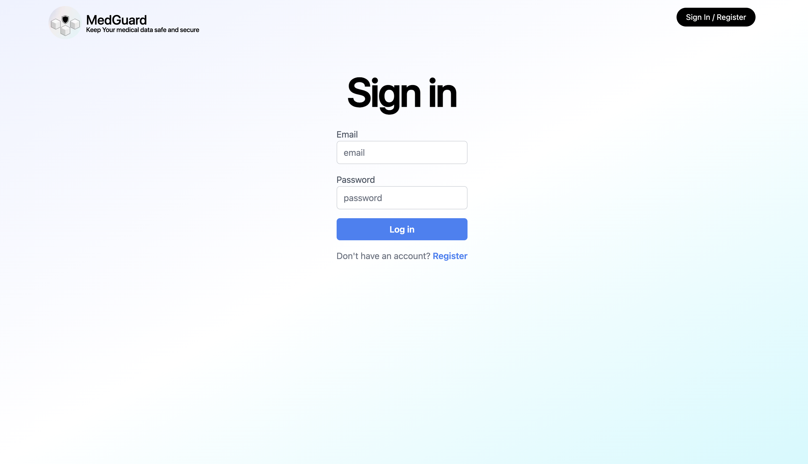
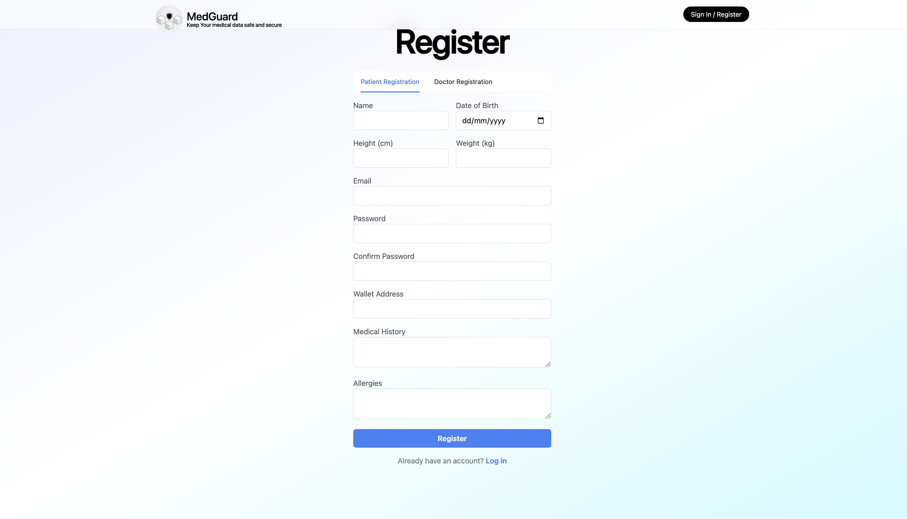
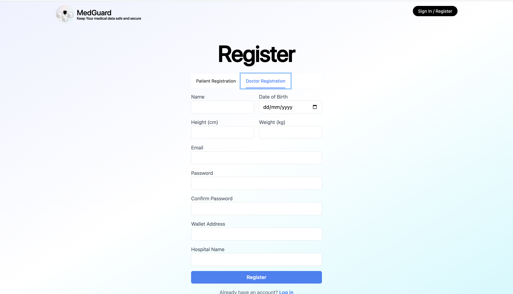

# MEDGUARD - Blockchain Based Healthcare System

Group project built by IS4302 AY22/23 Sem 2 Group 16

### About The Project

**MedGuard** is a Blockchain based healthcare system which help both doctors and patient to better storage, synchronize and verify medical records.

#### Build With

This project is built with [Next.js](https://nextjs.org/) adapted from [Precedent](https://github.com/steven-tey/precedent) 
and uses a third-party React UI library - [Ant Design](https://ant.design/)

### Get Started

1. Make sure you have Node.js installed on your computer with the version >= 14.0

2. Clone both backend and frontend code to your local host

- **Front end:** `git clone https://github.com/is4302/front-end.git` or `npx create-next-app MEDGUARD --example https://github.com/is4302/front-end` 

- **Backend:** `git clone https://github.com/is4302/back-end.git`

3. Under the root, run `npm install` to install all the dependencies

4. Follow the instructions [here](https://github.com/is4302/back-end#readme) to configure and set up the backend

5. Run `npm run dev` to start the frontend code

### Features + UI

#### Common View

1. Login

#### Patient View

1. Registration

2. Landing Page

3. View Doctor List

4. Make an appointment

5. View and verify past medical records

#### Doctor View

1. Registration

2. View appointment list

3. View patient's all past medical records

4. Make a prescription

